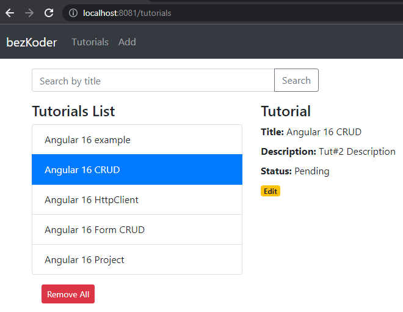

# Angular 16 example project: CRUD with Rest API

Build an Angular 16 CRUD example App to consume Rest APIs, display, modify & search data.

Tutorial Application in that:

- Each Tutorial has id, title, description, published status.
- We can create, retrieve, update, delete Tutorials.
- There is a Search bar for finding Tutorials by title.

Run `ng serve --port 8081` for a dev server. Navigate to `http://localhost:8081/`. The app will automatically reload if you change any of the source files.
